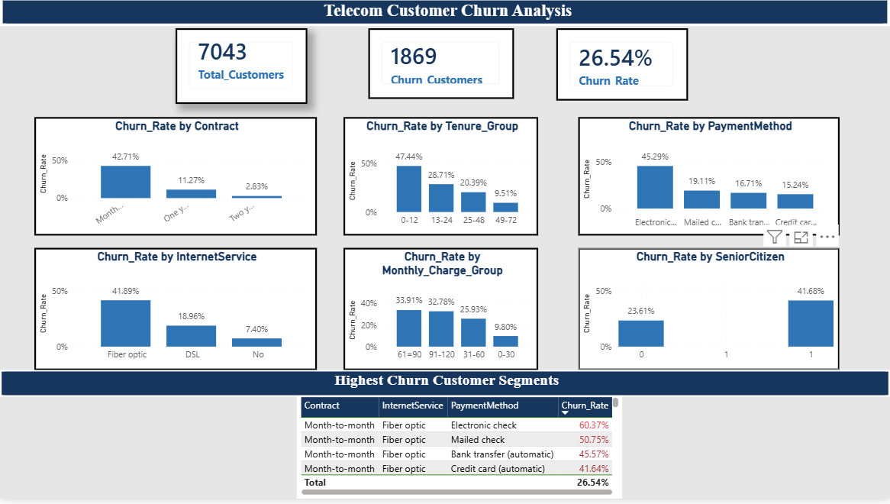
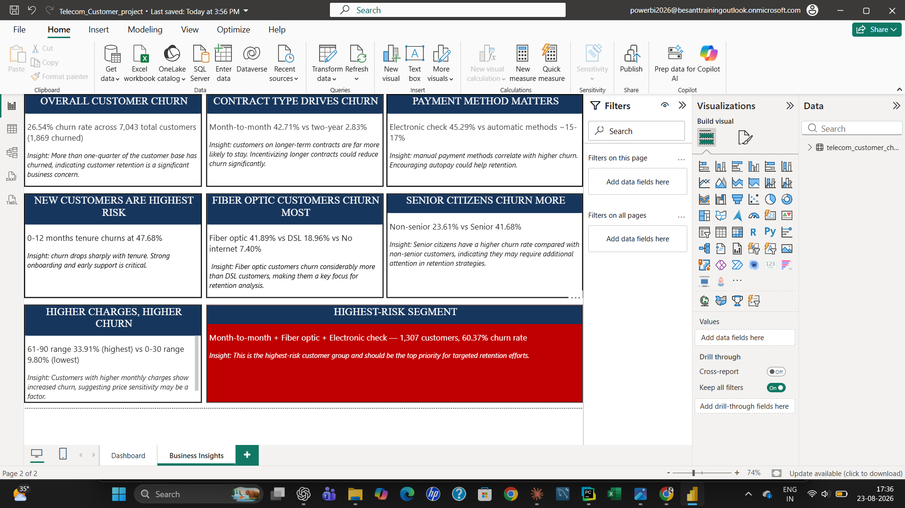

# Telecom Customer Churn Analysis

An end-to-end data analysis project exploring customer churn patterns for a telecom company, using SQL for data exploration, Python for analysis and visualization, and Power BI for an interactive dashboard.

## Project Overview

- **Total Customers:** 7,043
- **Churned Customers:** 1,869
- **Overall Churn Rate:** 26.54%

This project identifies the key drivers of customer churn — including contract type, payment method, internet service, tenure, and monthly charges — and highlights the highest-risk customer segments for targeted retention strategies.

## Project Highlights

- Analyzed **7,043 telecom customers** and identified **1,869 churned customers**.
- Performed data analysis using **SQL and Python**.
- Created visualizations using **Matplotlib**.
- Built an interactive **Power BI dashboard** to identify churn patterns and high-risk customer segments.

## Tools Used

- **SQL (MySQL)** — data exploration and churn rate calculations
- **Python (pandas, matplotlib)** — churn analysis and visualizations
- **Power BI** — interactive dashboard and business insights report

## Key Findings

- **Contract type:** Month-to-month customers churn at 42.71%, vs just 2.83% for two-year contracts.
- **Payment method:** Electronic check users churn at 45.29%, far higher than automatic payment methods (~15-17%).
- **Tenure:** New customers (0-12 months) churn at 47.68%, dropping sharply for long-tenure customers.
- **Internet service:** Fiber optic customers churn at 41.89%, the highest among service types.
- **Senior citizens:** Churn at 41.68%, notably higher than non-seniors (23.61%).
- **Highest-risk segment:** Month-to-month + Fiber optic + Electronic check customers churn at **60.37%**.

## Files in This Repository

| File | Description |
|------|-------------|
| `telecom_churn_queries.sql` | SQL queries used for customer churn analysis |
| `telecom_churn_analysis.py` | Python analysis and Matplotlib visualizations |
| `Telecom_Customer_project.pbix` | Power BI dashboard and business insights |
| `dashboard_screenshot.png` | Preview of the Power BI dashboard |
| `insights_screenshot.png` | Preview of the business insights page |

## Dashboard Preview

## Business Insights Preview

